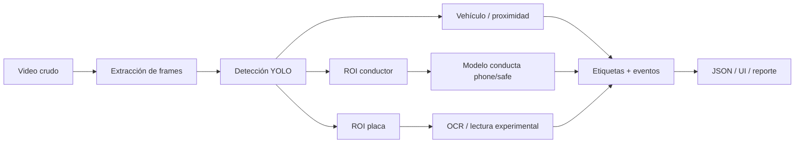

# QuisMotion TEKNOFEST FDR plan

Este documento consolida lo que acordamos para presentar QuisMotion de forma fuerte, honesta y defendible ante TEKNOFEST. La idea central es no vender humo: mostrar un sistema real de etiquetado de video, con evidencia cuantitativa, y separar claramente lo que ya funciona de lo que todavía requiere más datos.

## 1. Posicionamiento final del proyecto

QuisMotion debe presentarse como un pipeline modular de inteligencia artificial para etiquetado de video en escenarios de tránsito/seguridad:

Claim recomendado:

> QuisMotion implements a real video-labelling pipeline using YOLOv8, OpenCV, OCR components, and optional Roboflow-assisted dataset workflows. Vehicle detection and proximity estimation work on the provided low-light parking-garage videos. The focused phone-vs-safe behavior detector performs strongly on a held-out public dataset. Cigarette/smoking and exact plate OCR are treated as domain-adaptation targets because the available TEKNOFEST-like footage is low-resolution, side-angle, and data-limited.

## 2. Qué funciona ahora

| Área | Estado | Cómo defenderlo |
|---|---|---|
| MVP web/backend | Funcional | Hay frontend, backend FastAPI, WebSocket/API, videos demo y proveedores de IA modulares. |
| Videos de prueba | Funcional | Los tres videos `tekno-01`, `tekno-02`, `tekno-03` están integrados como demos. |
| Detección de vehículo | Fuerte | En los clips proporcionados se detecta el vehículo con alta confianza. |
| Proximidad / acercamiento | Fuerte como proxy | El crecimiento del bounding box sirve como señal medible de aproximación. |
| Dataset phone/safe | Fuerte | Dataset preparado con split train/valid/test y métricas reportables. |
| Modelo phone/safe | Fuerte en su dominio | Precision, recall, F1 y mAP son altos en test set del dominio público. |
| Roboflow | Soportado/modular | Útil para dataset, versionado, hosted inference y posible mejora de etiquetas. |
| Notebooks FDR | Listos como base | Están consolidados en `00` a `05`, alineados con las secciones del reporte. |

## 3. Qué NO debemos sobreprometer

| Tema | Estado real | Cómo escribirlo |
|---|---|---|
| Cigarette/smoking | Débil todavía | Requiere más frames manualmente etiquetados de dominio TEKNOFEST. |
| OCR de placa | Experimental | A 832x464 / 464p no hay suficiente resolución para lectura exacta confiable. |
| Velocidad real en km/h | No validada con ground truth | Reportar solo proxy de proximidad: área del bbox, no velocidad física exacta. |
| F1=1.00 | Válido solo para phone/safe en dataset público | No usarlo como métrica de todos los videos reales ni de cigarette. |
| NVIDIA/DeepStream | Futuro despliegue | No meterlo como núcleo de la solución actual salvo como optimización futura. |

Frase segura para el reporte:

> These metrics validate the focused phone-vs-safe model in the open-source dataset domain. Operational testing on TEKNOFEST-like low-light videos shows domain shift, especially for smoking/cigarette and plate OCR, therefore those labels are reported as experimental and require additional domain-specific annotation.

## 4. Mapa de notebooks final

Estos son los notebooks que deben usarse para llenar el documento FDR:

| Notebook | Sección TEKNOFEST | Propósito |
|---|---|---|
| `00_environment_setup.ipynb` | 3.3 / Apéndice | Reproducibilidad: Python, GPU, librerías, entorno. |
| `01_dataset_preparation.ipynb` | 2. Dataset Preparation | Fuentes, extracción, etiquetas, splits, balance y augmentation. |
| `02_problem_analysis.ipynb` | 3.1 Problem Analysis | Baja luz, blur, oclusión, reflejos, resolución 464p, dominio real. |
| `03_ai_architecture.ipynb` | 3.2 y 3.3 Solution Architecture/Details | Diagrama de pipeline, componentes, interfaces y post-procesamiento. |
| `04_model_training.ipynb` | 3.3 Solution Details | Entrenamiento YOLO, curvas, decisiones técnicas y límites. |
| `05_solution_testing.ipynb` | 4. Solution Testing | Métricas: precision, recall, F1, mAP, FPS y evidencia de confianza. |

Los notebooks antiguos quedaron archivados localmente en `notebooks/_archive/`, pero no deben ser el material principal de entrega.

## 5. Cómo llenar cada sección del documento TEKNOFEST

### 1. Project Summary

Escribir una visión general breve:

- sistema de etiquetado de video;
- entrada: video crudo;
- salida: bounding boxes, clases, riesgo/proximidad, evidencia visual;
- objetivo: detectar situaciones de riesgo como aproximación de vehículo y comportamiento del conductor.

No enfocar esta sección en login, teléfono simulado, acceso o partes de app que no sean IA.

### 2. Dataset Preparation

Incluir:

- videos TEKNOFEST-like usados para validación operacional;
- dataset público de conducción distraída usado para phone/safe;
- remapeo de clases:
  - `Texting` + `Talking on the phone` -> `phone`;
  - `Safe Driving` -> `safe`;
  - clases no usadas se excluyen del modelo focalizado;
- formato de etiquetas YOLO;
- split train/validation/test;
- justificación: mantener clases presentes en todos los splits y evitar leakage.

También explicar que los frames de cigarette/smoking son pocos y visualmente débiles; por eso no se reclama robustez todavía.

### 3.1 Problem Analysis

Problemas fundamentales:

- baja iluminación en parqueo;
- compresión de WhatsApp/video;
- motion blur;
- reflejos del vidrio;
- oclusión parcial del conductor;
- placas pequeñas en 464p;
- cigarrillo extremadamente pequeño;
- dominio público vs dominio real TEKNOFEST.

Solución escogida:

- YOLO por velocidad y facilidad de entrenamiento;
- pipeline modular por proveedores (`local`, `mock`, `roboflow`);
- OCR como experimento separado;
- Roboflow/Supervision como soporte de dataset y visualización, no como sustituto del modelo.

### 3.2 Solution Architecture

Usar la arquitectura:

1. video;
2. muestreo de frames;
3. detección principal;
4. extracción de ROIs;
5. clasificación/detección de comportamiento;
6. OCR experimental;
7. post-procesamiento;
8. salida JSON/UI/reporte.

Destacar que el sistema es modular: se puede probar con otros videos sin reescribir la solución.

### 3.3 Solution Details

Incluir:

- YOLOv8/Ultralytics para detección;
- OpenCV para frames, crops, resizing y preprocesamiento;
- EasyOCR/fast-plate-ocr como lectura experimental;
- Roboflow opcional para datasets/hosted inference;
- thresholds de confianza;
- resizing a 512 px para equilibrio FPS/calidad;
- separación entre modelo fuerte phone/safe y clases futuras cigarette/smoking.

### 4. Solution Testing

Mostrar:

- tabla de métricas del modelo phone/safe;
- FPS;
- evidencia con videos `tekno-01`, `tekno-02`, `tekno-03`;
- tabla de limitaciones reales;
- respuesta a “Why do we trust our solution?”:
  - porque hay test set separado;
  - hay métricas reproducibles;
  - hay validación operacional con videos externos;
  - se reportan limitaciones en vez de ocultarlas.

### 5. References

Referenciar:

- Ultralytics YOLO;
- OpenCV;
- Roboflow Universe;
- Roboflow Supervision;
- OCR library usada;
- PyTorch;
- cualquier dataset público utilizado.

## 6. Preprocessing y augmentation que sí tiene sentido documentar

| Técnica | Uso |
|---|---|
| Resize 320/416/512/640 | Comparar FPS vs confianza. |
| Brightness/exposure | Simular parqueos oscuros y cambios de luz. |
| Saturation | Robustez a iluminación artificial. |
| Rotation leve | Cámara inclinada o vehículo en ángulo. |
| Translation/scale | Objetos descentrados y cambios de distancia. |
| Gaussian blur | Motion blur. |
| Noise | Compresión, baja calidad y sensores débiles. |
| JPEG compression | Videos de WhatsApp/CCTV. |
| Occlusion/crop | Vidrios, manos, volante, columnas. |
| Horizontal flip | Útil para conducta, pero evitar usarlo para evaluación OCR de placas porque invierte texto. |

No hace falta entrenar todas las variantes para el FDR, pero sí se puede mostrar una tabla de robustez/stress-test si hay tiempo.

## 7. Supervision, Roboflow y NVIDIA

Decisión acordada:

- **Roboflow Supervision:** sí es útil ahora para anotaciones visuales, métricas, conteos, overlays, dataset QA y reportes.
- **Roboflow:** sí como integración modular y soporte de dataset/hosted inference.
- **NVIDIA TAO/DeepStream:** no como núcleo actual del FDR. Es viable como future work si se busca optimizar despliegue en tiempo real.

Cómo escribirlo:

> Roboflow/Supervision is used as a dataset and visualization support layer. The core model remains YOLO-based and locally reproducible. NVIDIA deployment tools are considered future optimization work for edge/real-time deployment.

## 8. Checklist antes de entregar

Prioridad alta:

- [ ] Exportar HTML/PDF final de los notebooks `00–05`.
- [ ] Verificar que los nombres de notebooks en el documento coincidan con los archivos actuales.
- [ ] Incluir tabla de dataset/splits.
- [ ] Incluir tabla de métricas.
- [ ] Incluir arquitectura visual.
- [ ] Añadir párrafo honesto sobre cigarette/smoking.
- [ ] Añadir párrafo honesto sobre OCR de placa.
- [ ] No mencionar acceso/login/número simulado como parte central de IA.

Prioridad media:

- [ ] Agregar ejemplos visuales de augmentation.
- [ ] Hacer una tabla de stress-test por blur/brightness/noise.
- [ ] Separar resultados de dataset público vs videos TEKNOFEST.
- [ ] Preparar capturas del frontend con detecciones reales.

Prioridad baja:

- [ ] Mencionar búsqueda vectorial/incident retrieval solo como future work.
- [ ] Mencionar NVIDIA solo como despliegue futuro.

## 9. Estado final recomendado

Veredicto:

> El proyecto es viable para TEKNOFEST si se presenta como pipeline funcional con evidencia y limitaciones claras. No conviene prometer detección robusta de cigarrillo ni OCR perfecto. La fortaleza está en detección de vehículo/proximidad, arquitectura modular, dataset preparado, modelo phone/safe y notebooks de evaluación.

